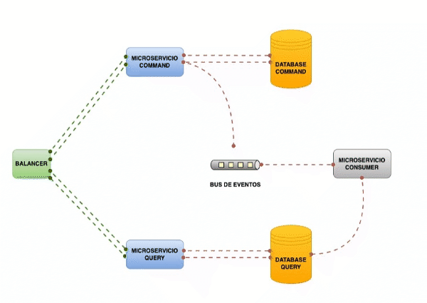

# Microservicios - CQRS
#### _Command Query Responsibility Segregation_
>
> **_CQRS_** es un patrón de diseño de software para microservicios que implementa la separación de lógica de nuestras aplicaciones para las acciones de escritura y lectura de datos.
>
> Las siglas **_CQRS_** vienen del inglés y significan “**C**ommand **Q**uery **R**esponsibility **S**egregation”. Lo que se puede traducir en separación en la responsabilidad de lecturas y comandos.
>
> 

## Stack

- SpringBoot 3.1.2
- JDK17
- Maven
- Postgres
- Kafka
- Docker | Docker Compose
- NGINX


## Build

```shell
mvn clean install
```

## Run

```shell
docker-compose -f docker-compose.yaml -p microservicios-cqrs up -d --build
``` 

## Down

```shell
docker-compose -f docker-compose.yaml -p microservicios-cqrs down -d --remove-orphans -rmi local --volumes
``` 

## Arquitectura
